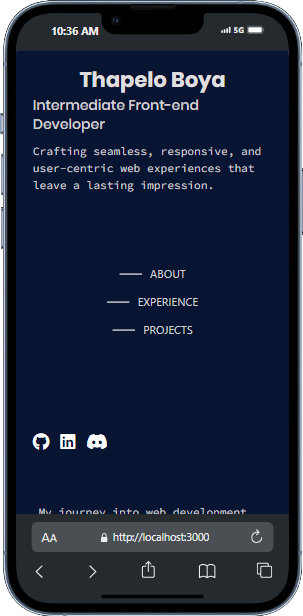

# Personal Portfolio

This is my personal portfolio, showcasing my skills, experience, and projects as a front-end developer. The site is built using **React** and styled with **Tailwind CSS**. It also features smooth scrolling, a custom mouse cursor effect, and links to my social media profiles.

## Live Demo
[Visit the live portfolio]([https://your-portfolio-link.com)](https://portfolio-8o4gvq9a9-foxsugarprotonmes-projects.vercel.app/)

## Features

- **Responsive Design**: Optimized for mobile and desktop views.
- **Smooth Scrolling**: Navigate easily between sections with smooth scrolling powered by **react-scroll**.
- **Custom Mouse Cursor**: A unique mouse cursor effect for an interactive experience.
- **Social Media Links**: Direct links to my **GitHub**, **LinkedIn**, and **Instagram**.
- **Project Showcase**: Highlights of my personal projects, including live demo links and tech stacks.

## Screenshots



## Installation

To run this project locally:

1. **Clone the repository**:
    ```bash
    git clone https://github.com/thapeloboya/portfolio.git
    ```

2. **Navigate to the project directory**:
    ```bash
    cd portfolio
    ```

3. **Install dependencies**:
    ```bash
    npm install
    ```

4. **Run the app**:
    ```bash
    npm start
    ```

This will open the project in your browser at `http://localhost:3000`.

## Technologies Used

- **React**: For building the UI with reusable components.
- **Tailwind CSS**: For styling the application.
- **react-scroll**: For smooth scrolling navigation.
- **FontAwesome**: For social media icons.

## Sections of the Portfolio

### 1. **About Me**
   A brief overview of my journey into web development, including my skills, interests, and personal background.

### 2. **Experience**
   A list of my professional experiences, highlighting the roles, companies, and skills I've used.

### 3. **Projects**
   Showcase of my key projects with descriptions, technologies used, and live demo links.

### 4. **Social Links**
   Connect with me on **GitHub**, **LinkedIn**, and **Instagram** via links in the footer.

## Contributing

If you'd like to contribute to the project:

1. Fork the repository.
2. Create a new branch for your changes.
3. Commit your changes.
4. Push your branch and create a pull request.

## License

This project is open-source and available under the [MIT License](LICENSE).

## Acknowledgments

- Thanks to **React** and **Tailwind CSS** for the great development experience.
- Special thanks to **FontAwesome** for the icon library used in the social links.
